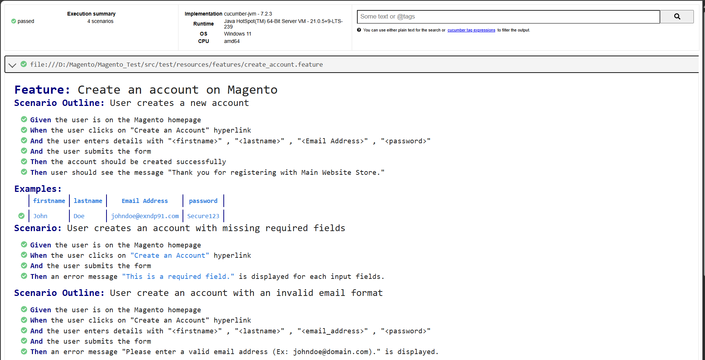

# Automation Framework with Selenium, Cucumber, and Maven

## Overview

This repository contains an automation framework built using **Selenium**, **Cucumber**, and **Maven**. This repository contains an automation framework for testing the user sign-up flow of the website **[Magento](https://magento.softwaretestingboard.com/)** using **Selenium**, **Cucumber**, and **Maven**. The framework is structured to facilitate easy and effective automated testing while adhering to best practices.

## Features

- **Behavior-Driven Development (BDD)**: Utilizes Cucumber for writing test cases in Gherkin syntax, making them easy to understand for non-technical stakeholders.
- **Cross-Browser Testing**: Supports multiple browsers through Selenium WebDriver.
- **Test Reporting**: Generates detailed test reports to track test execution results.

## Report

